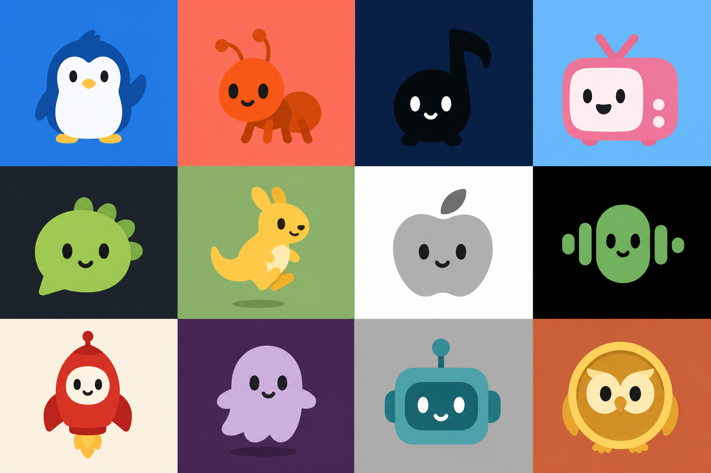

# IPbuildlogo

Agent Skill：生成高度简化的 IP 吉祥物 logo，并内置 **20+ 知名公司品牌风格预设**（腾讯、阿里、B 站、Apple、Spotify 等），方便快速产出有辨识度的原创方向。

**作者：** WillNam · https://github.com/WillNam/IPbuildlogo

遵循开放 Agent Skills 格式，兼容 Codex、Cursor 等 Agent 环境。



## 核心能力

| 能力 | 说明 |
|------|------|
| Logo 规范 | 圆角轮廓、三语义色、32×32 可识别 |
| 品牌风格预设库 | 20+ 公司/行业锚点 |
| 行业模板 | fintech / edtech / AI 等 |
| 示例 Prompt | 中英双语 |
| 商标规避 | do-not-copy 清单 |

> **重要：** 预设仅作**设计方向参考**，输出必须是**原创**吉祥物，不得复制任何注册商标图形。

## 安装

```bash
npx skills@latest add WillNam/IPbuildlogo
```

全局安装：

```bash
npx skills@latest add WillNam/IPbuildlogo --global
```

或手动复制 `SKILL.md` 及 `references/`、`examples/` 到项目的 `.cursor/skills/` 或 `.codex/skills/` 目录。

## 使用

### 品牌风格参考

```text
为我的 App 设计一个腾讯风格的原创企鹅吉祥物 logo，背景科技蓝，生成 6 个候选。
```

Agent 会读取 `references/brand-presets.md` 中的 Tencent 预设，提取圆润、社交、配色等方向，**但不会复制 QQ 企鹅商标**。

### 行业模板

```text
这是一个 fintech 产品，请提出 3 个 IP 方向并生成 6 张 logo。
```

### 自由创作

```text
Create a rounded ghost IP logo on deep navy background.
```

## 内置品牌预设（部分）

**中国互联网：** 腾讯、阿里、字节跳动、美团、 B 站、微信、京东、小米、华为、网易

**全球：** Apple、Google、Meta、Amazon、Spotify、Slack、Discord、Nike、Starbucks、Coca-Cola

完整列表见 [`references/brand-presets.md`](references/brand-presets.md)。

## 仓库结构

```text
SKILL.md                          # 主 Skill 指令
references/
  brand-presets.md                # 知名公司风格预设
  industry-templates.md           # 行业 IP 模板
examples/
  prompts.md                      # 中英示例 Prompt
assets/
  ip-logo-showcase.png            # 展示图
README.md
LICENSE
```

## 核心规范（摘要）

- 一个主导圆角轮廓，约 6–10 个基础形
- 默认三语义色：2 个 IP 色 + 1 背景色
- 三个方向 → 六张独立候选（A1–C2）
- 75–85% 角落构图，配对特征必须完整
- Flat-first + 连续渐变微体积（OKLCH L 变化 ≤ 0.08）
- 禁止复制商标、禁止 contact sheet 拼版

## License

Copyright © 2026 [WillNam](https://github.com/WillNam) · MIT — 见 [LICENSE](LICENSE)
